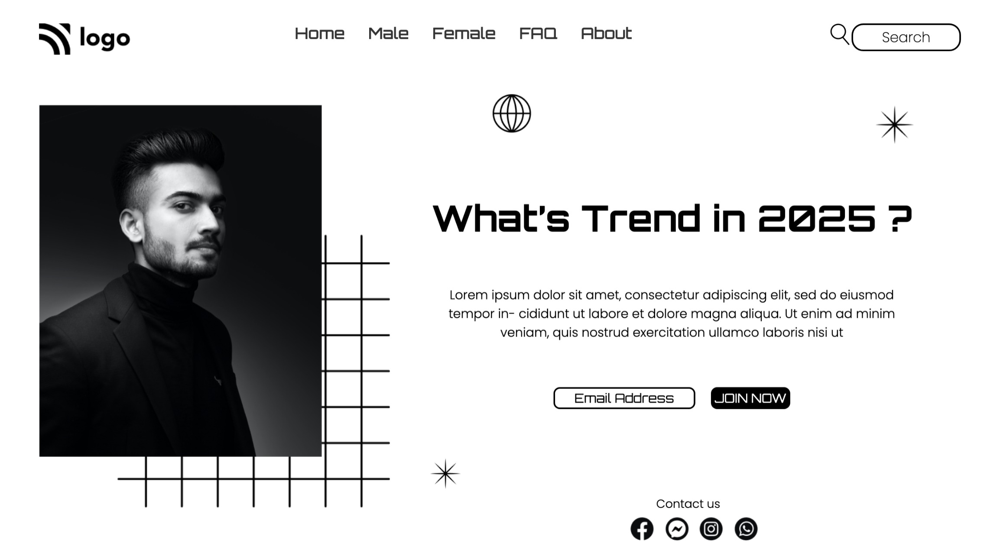

# Street Style Landing Page

- This is a street style landing page, made using html and css 

## Screenshot

## Note:
- This is not mobile resposive website(made for desktop)

## Built with

- Semantic HTML5 markup
- CSS custom properties
- Flexbox

## What I learned
- I learned how to arrange components with flexbox and learned about absolute and relative position, as well as z-index. 

## Time taken
- It took me around 4 hours since I had difficulty positioning components.however, as I learned about relative and absolute positioning, it became simple.

## Links
- [live demo](https://street-style-landing-pg.netlify.app/)
- [source](https://github.com/RAM844/Street-style-landing-page)

## Contact me
- GitHub - [@RAM844](https://github.com/RAM844)
- Frontend Mentor - [@RAM844](https://www.frontendmentor.io/profile/RAM844)
- Twitter - [@ShriramBalaji7](https://www.twitter.com/ShriramBalaji7)